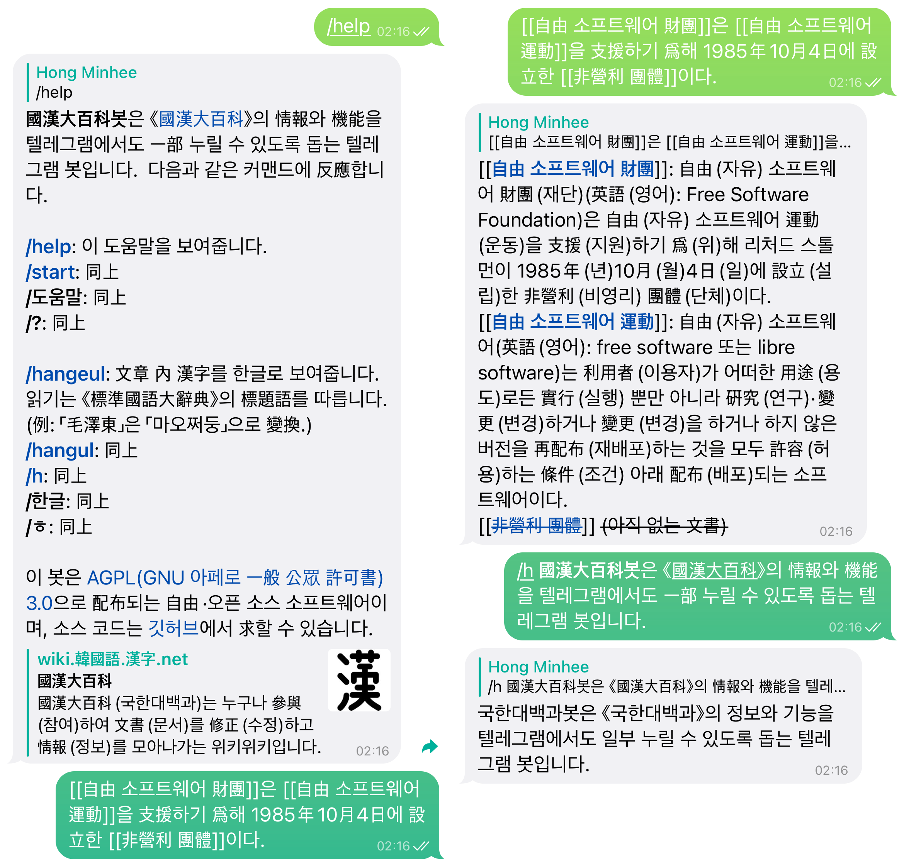

<!-- deno-fmt-ignore-file -->

🤖 國漢大百科봇
===============

**國漢大百科봇**\([@GukhanBot])은 《[國漢大百科]》의 情報와 機能을
텔레그램에서도 一部 누릴 수 있도록 돕는 텔레그램 봇입니다.

利用하시려면 [@GukhanBot]에게 말을 걸거나, 對話 그룹에 [@GukhanBot]을
데려오시면 됩니다. 仔細한 使用法은 `/help` 커맨드를 通해 볼 수 있습니다.

[@GukhanBot]: https://t.me/GukhanBot
[國漢大百科]: https://wiki.xn--9cs231j0ji.xn--p8s937b.net/

開發 및 改善
------------

이 소프트웨어는 [디노] 플랫폼을 必要로 합니다.  디노가 깔려있지 않으면
먼저 設置한 뒤, 아래 커맨드로 實行해 볼 수 있습니다.

~~~~ bash
TELEGRAM_BOT_TOKEN=... deno run --allow-net --allow-env bot.ts
~~~~

[디노]: https://deno.land/

### 環境 變數

몇 가지 必須 設定 및 옵션을 環境 變數로 받습니다.

 -  `TELEGRAM_BOT_TOKEN` (必須): 開發 및 테스트 用度의 봇 어카운트를 만들어서
    그 봇 어카운트의 토큰을 넣어야 합니다.
 -  `SEONBI_API_BIN` (옵션): [선비] HTTP API 서버의 實行 파일(`seonbi-api`)
    位置를 받습니다.  비워두면 알아서 公式 릴리스를 받아서 實行합니다.

[선비]: https://github.com/dahlia/seonbi

라이선스
--------

이 봇은 [AGPL (GNU 아페로 一般 公眾 許可書) 3.0][AGPLv3]으로 配布되는 自由·오픈
소스 소프트웨어입니다.

[AGPLv3]: https://www.gnu.org/licenses/agpl-3.0.html
